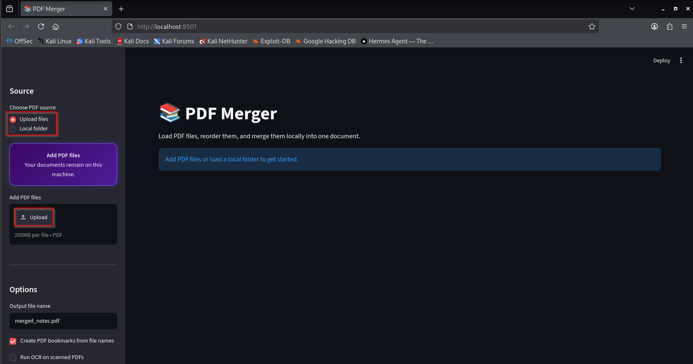
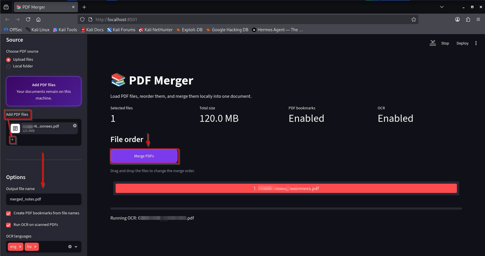
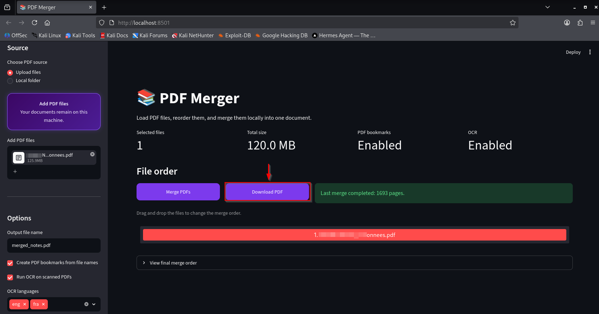

# PDF Merger — English Documentation

[🏠 Home](README.md) · [🇫🇷 Lire en français](PDFMerger-FR.md)

```diff
+ Local PDF merging
+ Drag-and-drop ordering
+ Optional OCR and bookmarks
- No documents sent to third-party services
```

## Overview

PDF Merger is a local-first web application built with Python and Streamlit.
It was created to consolidate cybersecurity notes, labs, technical
documentation, research papers, and other large PDF collections without
uploading them to an online service.

```text
YOUR PDFs → LOCAL PROCESSING → SEARCHABLE OUTPUT
                 │
                 └── no external upload
```

## Visual walkthrough

### 1. Select the PDF source

Choose **Upload files** to select documents manually, or **Local folder** to
load PDFs from a trusted directory. The highlighted **Upload** button opens
the system file picker.



### 2. Add documents and configure the merge

Use the **+** control to append more PDF files without restarting the
application. Set the output filename, enable bookmarks or OCR when needed,
select the OCR languages, and then click **Merge PDFs**.



### 3. Download the result

After the merge completes, the **Download PDF** button appears beside the
merge control. The success message confirms the number of pages in the final
document.



## Features

### PDF merging

- Merge multiple PDF files into one document.
- Process large collections using local system resources.
- Download the completed document directly from the interface.
- Follow the operation through a progress indicator.

### Two input modes

**Upload mode**

- Select multiple files from the Streamlit interface.
- Add more documents during the current session.

**Local-folder mode**

- Load every PDF from a local directory.
- Optionally scan subdirectories.
- Work efficiently with structured note repositories.

```text
CyberNotes/
├── Blue-Team/
├── Detection-Engineering/
├── Malware-Analysis/
├── Pentest/
└── Research/
```

### Interactive ordering

Files can be reordered through drag and drop before the merge begins. The
displayed order becomes the final document order.

### PDF bookmarks

Optional bookmarks are generated from filenames:

```text
Merged PDF
├── Blue Team Notes
├── Detection Engineering Labs
├── Malware Analysis
└── Pentest Workbook
```

### OCR

OCRmyPDF and Tesseract can make scanned documents searchable before they are
merged.

Supported languages in the current configuration:

- English: `eng`
- French: `fra`

OCR can also rotate and deskew scanned pages. Processing time depends on the
number, resolution, and complexity of the documents.

### Identical filenames

Each input receives a unique internal identifier. Files named `Notes.pdf`
from different directories can therefore coexist without collisions.

> [!NOTE]
> Identical filename support is not content-based duplicate detection.
> SHA-256 fingerprinting is planned to identify byte-for-byte duplicates.

## Privacy and security

| Property | PDF Merger | Typical online tool |
| --- | :---: | :---: |
| Local processing | ✅ | ❌ |
| Third-party upload | ❌ | ✅ |
| Account required | ❌ | Sometimes |
| Offline operation | ✅ | ❌ |
| Inspectable source code | ✅ | Rarely |
| Vendor file limits | ❌ | Often |

Practical limits depend on the memory, storage, and processing power of the
local machine.

> [!WARNING]
> PDF files can be malformed or malicious. Run the application as an
> unprivileged user, keep dependencies patched, and only expose local-folder
> mode to trusted users.

For local-only use, bind Streamlit to the loopback interface:

```bash
streamlit run PDFMerger.py \
  --server.address 127.0.0.1 \
  --server.port 8501
```

## Technology stack

| Component | Purpose |
| --- | --- |
| Python | application logic |
| Streamlit | local web interface |
| pypdf | PDF reading, merging, and bookmarks |
| streamlit-sortables | drag-and-drop ordering |
| OCRmyPDF | OCR processing and optimization |
| Tesseract OCR | character recognition |

## Installation

### System requirements

- Kali Linux, Debian, or a compatible Linux distribution
- Python 3.10 or later
- Tesseract language packs for the required OCR languages

### Automated installation

```bash
git clone https://github.com/jesscybersec/PDFMerger.git
cd PDFMerger
chmod +x install_kali.sh
./install_kali.sh
```

This command downloads the standalone PDF Merger repository.

### Manual installation

```bash
sudo apt update
sudo apt install -y \
  python3-full \
  python3-venv \
  ocrmypdf \
  tesseract-ocr \
  tesseract-ocr-eng \
  tesseract-ocr-fra

python3 -m venv venv
source venv/bin/activate
python -m pip install --upgrade pip
python -m pip install -r requirements.txt
```

### Run the application

```bash
source venv/bin/activate
streamlit run PDFMerger.py
```

## Expected project structure

```text
PDFMerger/
├── PDFMerger.py
├── requirements.txt
├── install_kali.sh
├── README.md
├── PDFMerger-EN.md
└── PDFMerger-FR.md
```

## Roadmap

- SHA-256 duplicate detection
- stronger PDF validation
- file preview and removal before merging
- encrypted and corrupted PDF handling
- page selection and extraction
- PDF splitting and compression
- metadata editing
- automatic table of contents
- local full-text indexing
- local RAG assistant
- rootless Docker deployment
- automated test corpus

## Security-oriented lab ideas

- Benchmark memory usage with 10, 100, and 500 PDFs.
- Test valid, encrypted, malformed, and scanned documents.
- Compare OCR accuracy and processing time across languages.
- Add structured logs without recording document contents.
- Build a threat model for local and network-exposed deployments.

## Final thoughts

PDF Merger follows a simple principle: documents should not have to leave
your computer just to be reorganized.

The interface stays approachable, the workflow remains inspectable, and the
data stays where it belongs.

```text
[ MERGE COMPLETE ]
[ CLOUD EXPOSURE: 0 ]
[ PRIVACY MODE: ACTIVE ]
```

---

[🏠 Back to home](README.md) · [🇫🇷 Lire en français](PDFMerger-FR.md)
